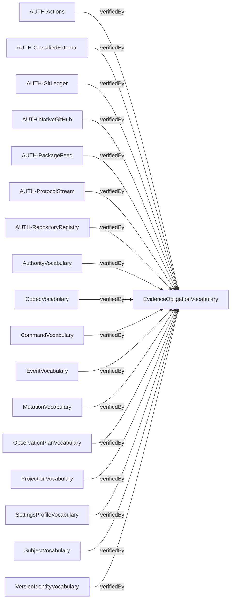
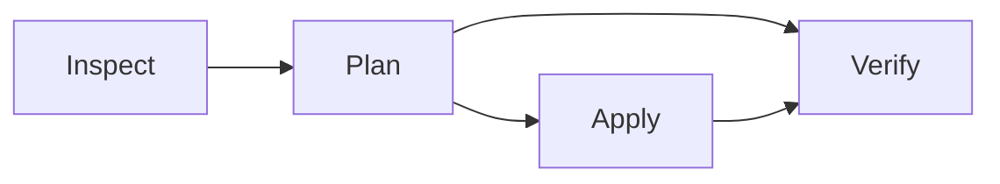

# Compiled contract diagrams

Source: `3bdcbe1ae4c3e3c9a9ca71b9c629106085034454781caf4bff8d9349cfc41aeb`

Behavior: `39a90f7bfb03c4a517dc91f324e80c986e51191b16da92570e1e8c84e61d5125`

Contract: `c608c0d28ce5cbf36e70f102ffa979f4d06f27305e6da4551dce454901811c8e`

