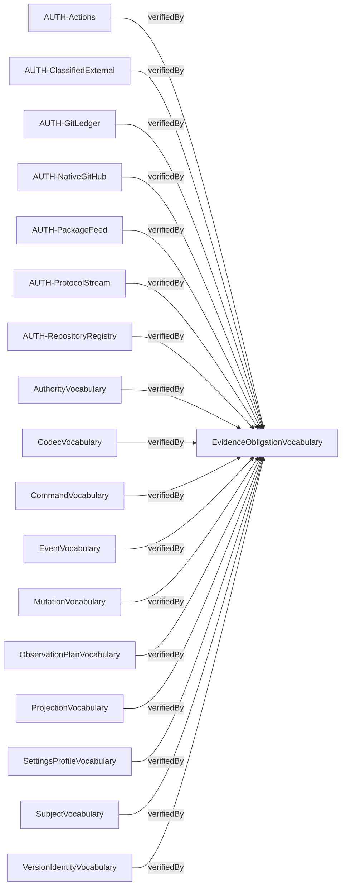
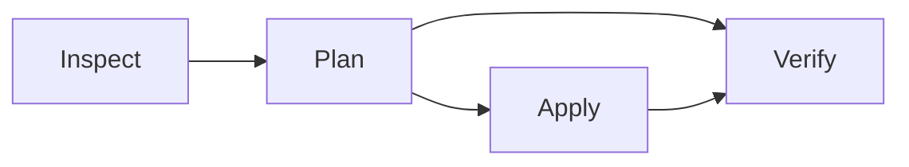

# Compiled contract diagrams

Source: `9744d83e81779bb883ad5bf4193d060f89d79aefd3e5ed102b8a02fb5f56439c`  
Contract: `90dd92eca75971c2159efdc2cfa3c168f74eab491bf52568580e2526d49a7ee3`

```mermaid
graph LR
  AUTH_Actions["AUTH-Actions"] -->|verifiedBy| EvidenceObligationVocabulary["EvidenceObligationVocabulary"]
  AUTH_ClassifiedExternal["AUTH-ClassifiedExternal"] -->|verifiedBy| EvidenceObligationVocabulary["EvidenceObligationVocabulary"]
  AUTH_GitLedger["AUTH-GitLedger"] -->|verifiedBy| EvidenceObligationVocabulary["EvidenceObligationVocabulary"]
  AUTH_NativeGitHub["AUTH-NativeGitHub"] -->|verifiedBy| EvidenceObligationVocabulary["EvidenceObligationVocabulary"]
  AUTH_PackageFeed["AUTH-PackageFeed"] -->|verifiedBy| EvidenceObligationVocabulary["EvidenceObligationVocabulary"]
  AUTH_ProtocolStream["AUTH-ProtocolStream"] -->|verifiedBy| EvidenceObligationVocabulary["EvidenceObligationVocabulary"]
  AUTH_RepositoryRegistry["AUTH-RepositoryRegistry"] -->|verifiedBy| EvidenceObligationVocabulary["EvidenceObligationVocabulary"]
  AuthorityVocabulary["AuthorityVocabulary"] -->|verifiedBy| EvidenceObligationVocabulary["EvidenceObligationVocabulary"]
  CodecVocabulary["CodecVocabulary"] -->|verifiedBy| EvidenceObligationVocabulary["EvidenceObligationVocabulary"]
  CommandVocabulary["CommandVocabulary"] -->|verifiedBy| EvidenceObligationVocabulary["EvidenceObligationVocabulary"]
  EventVocabulary["EventVocabulary"] -->|verifiedBy| EvidenceObligationVocabulary["EvidenceObligationVocabulary"]
  MutationVocabulary["MutationVocabulary"] -->|verifiedBy| EvidenceObligationVocabulary["EvidenceObligationVocabulary"]
  ObservationPlanVocabulary["ObservationPlanVocabulary"] -->|verifiedBy| EvidenceObligationVocabulary["EvidenceObligationVocabulary"]
  ProjectionVocabulary["ProjectionVocabulary"] -->|verifiedBy| EvidenceObligationVocabulary["EvidenceObligationVocabulary"]
  SettingsProfileVocabulary["SettingsProfileVocabulary"] -->|verifiedBy| EvidenceObligationVocabulary["EvidenceObligationVocabulary"]
  SubjectVocabulary["SubjectVocabulary"] -->|verifiedBy| EvidenceObligationVocabulary["EvidenceObligationVocabulary"]
  VersionIdentityVocabulary["VersionIdentityVocabulary"] -->|verifiedBy| EvidenceObligationVocabulary["EvidenceObligationVocabulary"]
```

```mermaid
flowchart LR
  Inspect --> Plan
  Plan --> Apply
  Plan --> Verify
  Apply --> Verify
```
