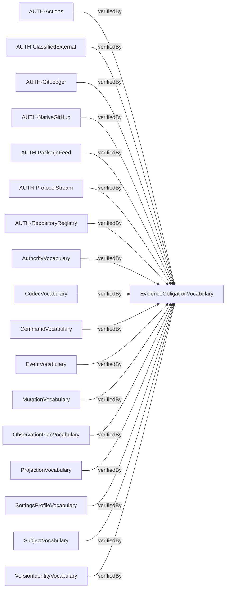
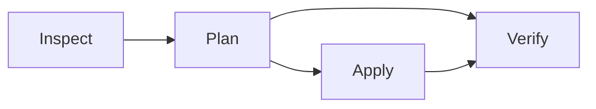

# Compiled contract diagrams

Source: `f0ef41ce606977a1ee13962f65318b8c45e1d74a6d81ceccd532178039e581cb`

Behavior: `0635606ecde88453acc7d25cdc03b24dda042ac39d9a2ce8afc8242b44ed5715`

Contract: `137852914a1a7ec6e3af62be0f5c0c890390e02640775cddf97afa789dcb7d8b`

