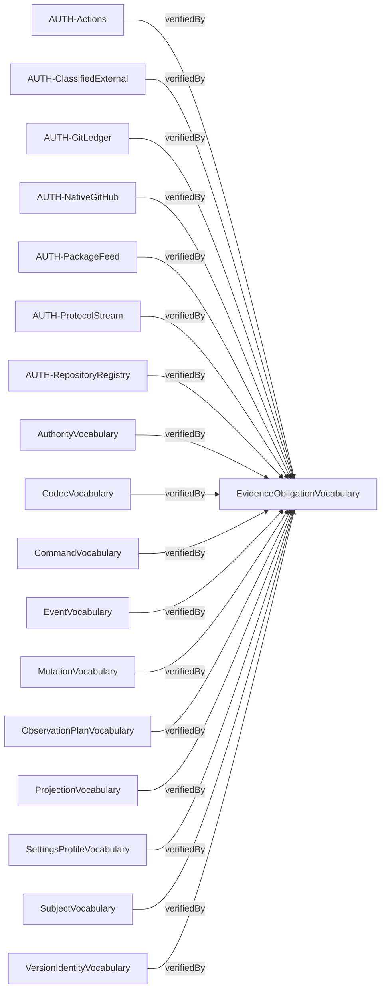
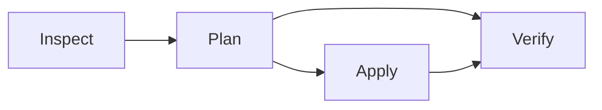

# Compiled contract diagrams

Source: `b295b7bc8b75b2f3a8856a9a0c7851a91dcd591b6314e071ded16128b5967570`

Behavior: `7d7dd76d29d4a26555eeed5069215504e188990cfdd15a7ede719c051bd52d1a`

Contract: `60bf639dc6c6e4a31ac284c57d85cb10a5cd7c0cce5532552884b5a3ea1b8c76`

