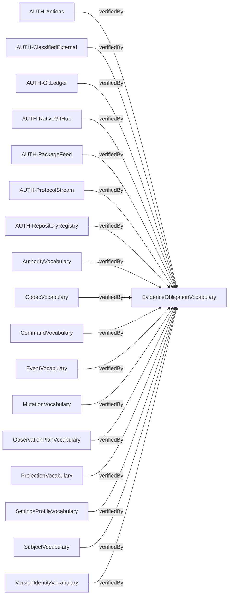
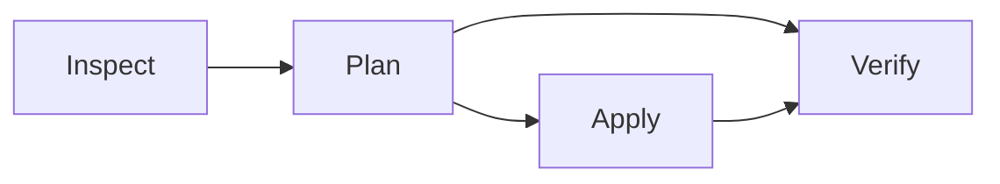

# Compiled contract diagrams

Source: `226ddc49e59dd2f8e9c140e57da92dda7f5a00cd02ccfb07885753117d2bd95b`

Behavior: `66618eb8a45c1cea91eb74408d0f2d9851be53695af8383e3617cb12807fd648`

Contract: `a77921dadee641e12fd20929ffebd2b396c68847a969b0ce8e1cd9c3e4f4795c`

