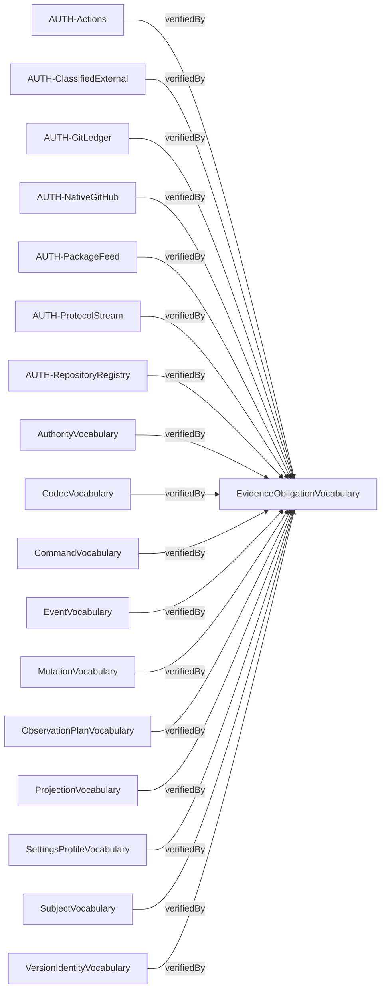
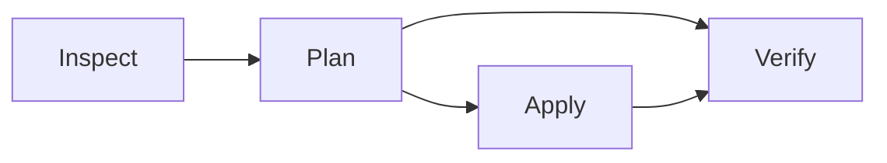

# Compiled contract diagrams

Source: `e18d4209e6159ac6cf19b04b89d79017f0f34cbd2aac8fc1d4fc9eeca117bff3`

Behavior: `c60fb49e78385bbd50e21b20bc90a1d682f967de8c2825690aca81d25d3db132`

Contract: `947262bc9f70c371d79a917804d2ed4adcabbb1cc2ff683eedc637e36e6b163e`

