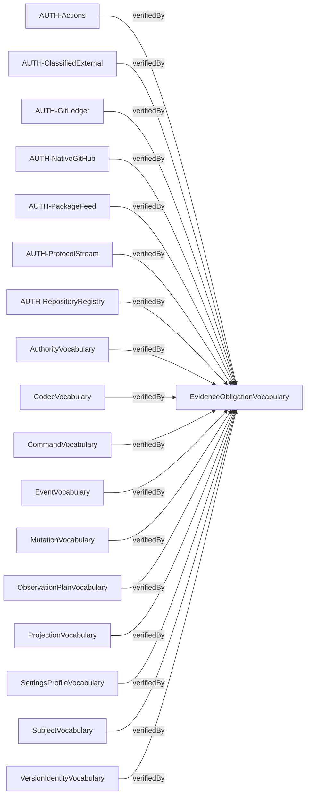
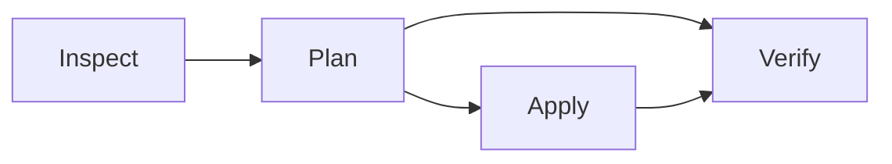

# Compiled contract diagrams

Source: `6b190fa12ebd883e8131c8f385943ae172da03a4c1856961fe22feb8bfd737d2`

Behavior: `bd1e92bae8f0ffd1598019b0d9c4510f25f139931b743807944962b89f758883`

Contract: `9c89970f289f711a4b58181fd330d914ec339dfb13e3af56da36ca6cf5070a4c`

