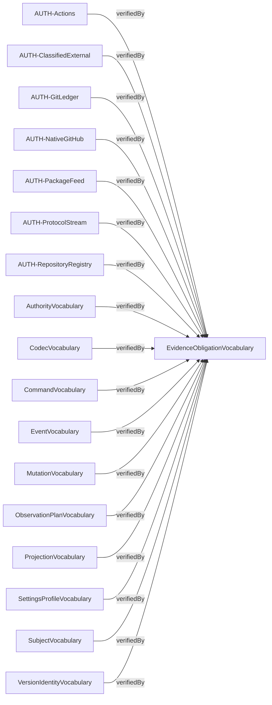
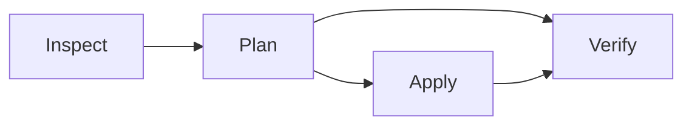

# Compiled contract diagrams

Source: `ab114cbfd7738dd1568ce2da3250b7b141b7d5759169bd9d9fb23d3165bdd354`

Behavior: `9d2581c99badfb89acdb359acceb0a1ba560322939d47944e58aa1fdcf10e05b`

Contract: `791c65eacbc4ef93484673ed6c40d3e8ca21fd75f34371e58c9f954f757c1a64`

```mermaid
graph LR
  AUTH_Actions["AUTH-Actions"] -->|verifiedBy| EvidenceObligationVocabulary["EvidenceObligationVocabulary"]
  AUTH_ClassifiedExternal["AUTH-ClassifiedExternal"] -->|verifiedBy| EvidenceObligationVocabulary["EvidenceObligationVocabulary"]
  AUTH_GitLedger["AUTH-GitLedger"] -->|verifiedBy| EvidenceObligationVocabulary["EvidenceObligationVocabulary"]
  AUTH_NativeGitHub["AUTH-NativeGitHub"] -->|verifiedBy| EvidenceObligationVocabulary["EvidenceObligationVocabulary"]
  AUTH_PackageFeed["AUTH-PackageFeed"] -->|verifiedBy| EvidenceObligationVocabulary["EvidenceObligationVocabulary"]
  AUTH_ProtocolStream["AUTH-ProtocolStream"] -->|verifiedBy| EvidenceObligationVocabulary["EvidenceObligationVocabulary"]
  AUTH_RepositoryRegistry["AUTH-RepositoryRegistry"] -->|verifiedBy| EvidenceObligationVocabulary["EvidenceObligationVocabulary"]
  AuthorityVocabulary["AuthorityVocabulary"] -->|verifiedBy| EvidenceObligationVocabulary["EvidenceObligationVocabulary"]
  CodecVocabulary["CodecVocabulary"] -->|verifiedBy| EvidenceObligationVocabulary["EvidenceObligationVocabulary"]
  CommandVocabulary["CommandVocabulary"] -->|verifiedBy| EvidenceObligationVocabulary["EvidenceObligationVocabulary"]
  EventVocabulary["EventVocabulary"] -->|verifiedBy| EvidenceObligationVocabulary["EvidenceObligationVocabulary"]
  MutationVocabulary["MutationVocabulary"] -->|verifiedBy| EvidenceObligationVocabulary["EvidenceObligationVocabulary"]
  ObservationPlanVocabulary["ObservationPlanVocabulary"] -->|verifiedBy| EvidenceObligationVocabulary["EvidenceObligationVocabulary"]
  ProjectionVocabulary["ProjectionVocabulary"] -->|verifiedBy| EvidenceObligationVocabulary["EvidenceObligationVocabulary"]
  SettingsProfileVocabulary["SettingsProfileVocabulary"] -->|verifiedBy| EvidenceObligationVocabulary["EvidenceObligationVocabulary"]
  SubjectVocabulary["SubjectVocabulary"] -->|verifiedBy| EvidenceObligationVocabulary["EvidenceObligationVocabulary"]
  VersionIdentityVocabulary["VersionIdentityVocabulary"] -->|verifiedBy| EvidenceObligationVocabulary["EvidenceObligationVocabulary"]
```

```mermaid
flowchart LR
  Inspect --> Plan
  Plan --> Apply
  Plan --> Verify
  Apply --> Verify
```
