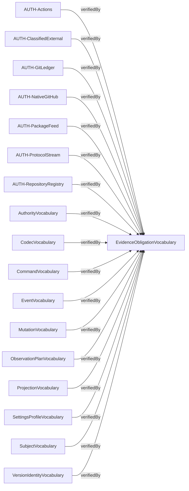
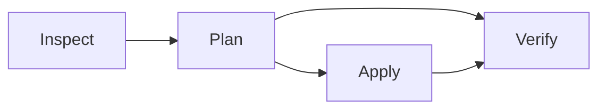

# Compiled contract diagrams

Source: `a6963369b7780a13d6360e1a0058594d643c39952d4e1ffedad36c87d43829ca`

Behavior: `a75e17f802db0168f58d19ff8b30525b427a6cf278df2eede97453314678fda1`

Contract: `49800c920d1a5db3beb812d58a3b4523b054e980cee98b68d680d25ca0ceaf01`

```mermaid
graph LR
  AUTH_Actions["AUTH-Actions"] -->|verifiedBy| EvidenceObligationVocabulary["EvidenceObligationVocabulary"]
  AUTH_ClassifiedExternal["AUTH-ClassifiedExternal"] -->|verifiedBy| EvidenceObligationVocabulary["EvidenceObligationVocabulary"]
  AUTH_GitLedger["AUTH-GitLedger"] -->|verifiedBy| EvidenceObligationVocabulary["EvidenceObligationVocabulary"]
  AUTH_NativeGitHub["AUTH-NativeGitHub"] -->|verifiedBy| EvidenceObligationVocabulary["EvidenceObligationVocabulary"]
  AUTH_PackageFeed["AUTH-PackageFeed"] -->|verifiedBy| EvidenceObligationVocabulary["EvidenceObligationVocabulary"]
  AUTH_ProtocolStream["AUTH-ProtocolStream"] -->|verifiedBy| EvidenceObligationVocabulary["EvidenceObligationVocabulary"]
  AUTH_RepositoryRegistry["AUTH-RepositoryRegistry"] -->|verifiedBy| EvidenceObligationVocabulary["EvidenceObligationVocabulary"]
  AuthorityVocabulary["AuthorityVocabulary"] -->|verifiedBy| EvidenceObligationVocabulary["EvidenceObligationVocabulary"]
  CodecVocabulary["CodecVocabulary"] -->|verifiedBy| EvidenceObligationVocabulary["EvidenceObligationVocabulary"]
  CommandVocabulary["CommandVocabulary"] -->|verifiedBy| EvidenceObligationVocabulary["EvidenceObligationVocabulary"]
  EventVocabulary["EventVocabulary"] -->|verifiedBy| EvidenceObligationVocabulary["EvidenceObligationVocabulary"]
  MutationVocabulary["MutationVocabulary"] -->|verifiedBy| EvidenceObligationVocabulary["EvidenceObligationVocabulary"]
  ObservationPlanVocabulary["ObservationPlanVocabulary"] -->|verifiedBy| EvidenceObligationVocabulary["EvidenceObligationVocabulary"]
  ProjectionVocabulary["ProjectionVocabulary"] -->|verifiedBy| EvidenceObligationVocabulary["EvidenceObligationVocabulary"]
  SettingsProfileVocabulary["SettingsProfileVocabulary"] -->|verifiedBy| EvidenceObligationVocabulary["EvidenceObligationVocabulary"]
  SubjectVocabulary["SubjectVocabulary"] -->|verifiedBy| EvidenceObligationVocabulary["EvidenceObligationVocabulary"]
  VersionIdentityVocabulary["VersionIdentityVocabulary"] -->|verifiedBy| EvidenceObligationVocabulary["EvidenceObligationVocabulary"]
```

```mermaid
flowchart LR
  Inspect --> Plan
  Plan --> Apply
  Plan --> Verify
  Apply --> Verify
```
